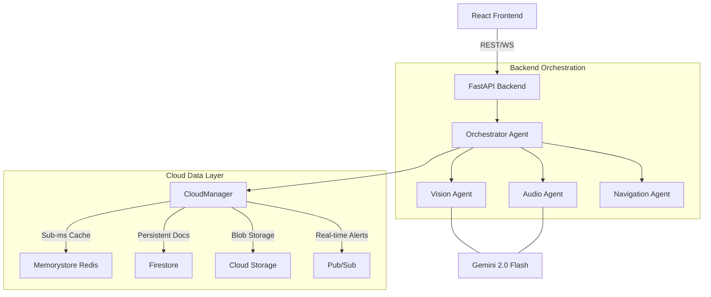

# OmniSense AI: Implementation & Architecture Guide

This document provides a technical deep-dive into the OmniSense AI multi-agent platform, optimized for high-performance cloud deployment on Google Cloud GCP.

## 1. System Architecture

OmniSense AI uses a **Cooperative Multi-Agent Architecture** powered by the **A2A Protocol v0.3** and **Google ADK**.

---

## 2. Core Components

### 🍏 Frontend (Mobile-First React)
- **Technology**: React 18+, Vite, Vanilla CSS.
- **Session Persistence**: Implements `sessionId` stored in `localStorage`. This ensures that even if a user refreshes their browser, the backend "remembers" their context and preferences.
- **Dynamic Routing**: Automatically detects if it's running locally or on Cloud Run, adjusting API URLs (REST/WS) accordingly to bypass local proxies in production.
- **Hooks**: `useAccessibility.js` handles the heavy lifting of media capturing, WebSocket bridging, and agent communication.

### 🐍 Backend (FastAPI & A2A)
- **A2A Protocol**: Every agent communicates via JSON-RPC 2.0, standardizing how skills are invoked and results are merged.
- **Agents**:
    - **Orchestrator**: The "brain" that merges vision, audio, and nav data into a unified accessibility context.
    - **VisionAgent**: Analyzes frames for safety hazards and environmental description.
    - **AudioAgent**: Monitors ambient sounds (doorbells, alarms) for hearing-impaired users.
    - **NavAgent**: Calculates geometric headings and haptic patterns for physical guidance.
- **Gemini Live**: Uses `aio.live` for low-latency multimodal interaction.

### ☁️ Cloud Data Layer (Tiered Storage)
OmniSense uses a three-tier storage strategy for maximum performance:
1.  **High-Speed Cache (Memorystore Redis)**: Stores active agent sessions and temporary context with 1-hour TTL.
2.  **Persistent Store (Firestore)**: Long-term storage for user preferences and session history (`omnisence-data` database).
3.  **Blob Storage (Cloud Storage)**: Stores image snapshots and audio clips for audit logs.

---

## 3. Deployment Logic

### 🐳 Docker Configuration
- **Backend**: Port 8080, standard Python slim image.
- **Frontend**: Multi-stage build (Node -> Nginx) on Port 80.

### 🔧 Environment Variables
| Variable | Description | Value Example |
| :--- | :--- | :--- |
| `Memorystore` | Redis caching host | `omnisense` |
| `FIRESTORE_DATABASE_ID` | Targeted Firestore DB | `omnisence-data` |
| `SNAPSHOT_BUCKET` | Destination for GCS blobs | `omnisensebkt` |
| `GEMINI_API_KEY` | Model authentication | (Managed via Secret Manager) |

---

## 4. Key Workflows

### Session Recovery Flow
1. Frontend pulls `sessionId` from `localStorage`.
2. Backend `CloudManager` checks Redis (Memorystore).
3. If miss, `CloudManager` restores from Firestore and primes the Redis cache.
4. Agent resumes context without user interruption.

### Multi-Modal Hazard Alert
1. VisionAgent detects a "Step Down" hazard.
2. AudioAgent hears a "Car Horn".
3. Orchestrator merges these and generates a **priority spoken alert** via the Accessibility hook.
4. `CloudManager` publishes a `CRITICAL_HAZARD` event to GCP Pub/Sub for external monitoring.

---
*Documentation generated by Antigravity for OmniSense AI.*
